# 💇‍♂️ Saloon App Admin Panel

A premium React-based administrative dashboard for the **Saloon Flutter Application**. This panel is seamlessly integrated with **Firebase** to provide real-time management for both platform owners and individual salon managers.

> [!IMPORTANT]
> **Demo Website:** [https://saloon-ai2.web.app/](https://saloon-ai2.web.app/)  
> **Project Type:** React.js Admin Panel (connected to Firebase & Flutter client app)

---

## 🚀 Overview
This repository contains the complete source code for the Saloon Admin Panel. It serves as the backend management system for the Saloon Flutter app, allowing for global control and branch-level operations.

### 📍 Project Path
The admin panel source code is located in the current directory:
`HassanAmeer/saloon-app-admin-reactjs`

---

## 🛠 Tech Stack
- **Frontend:** React.js (Vite)
- **Styling:** Tailwind CSS
- **Backend:** Firebase (Firestore, Hosting, Auth)
- **Client App:** Flutter (connected via Firebase)

---

## 👥 User Flows

The system architecture supports two distinct levels of access:

### 1. 👑 Super Admin Flow
The Super Admin has global control over the entire platform. They can manage all salon branches, create new salon managers, and update platform-wide settings.

- **URL Path:** `/super`
- **Default Credentials:** `admin@gmail.com` / `12345678`

#### **Super Admin Dashboard Preview:**
````carousel
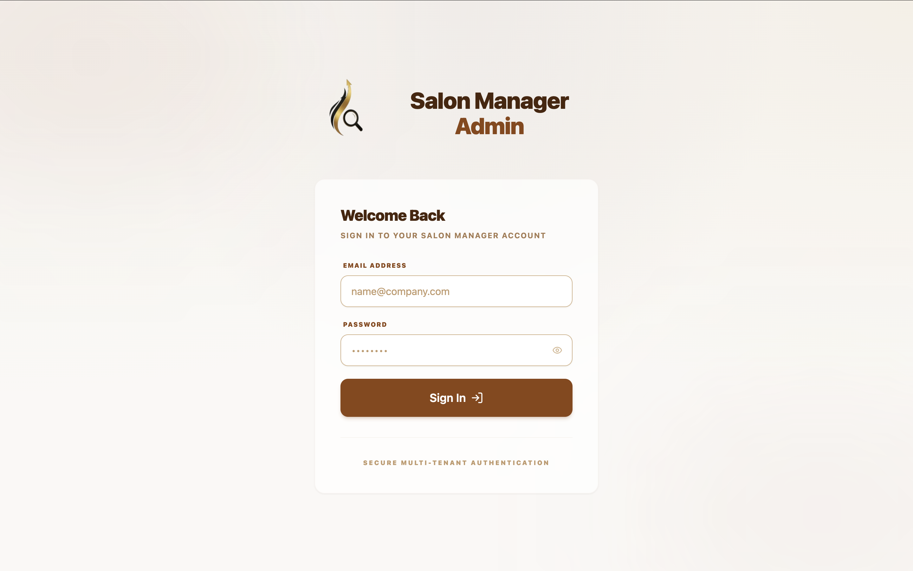
<!-- slide -->
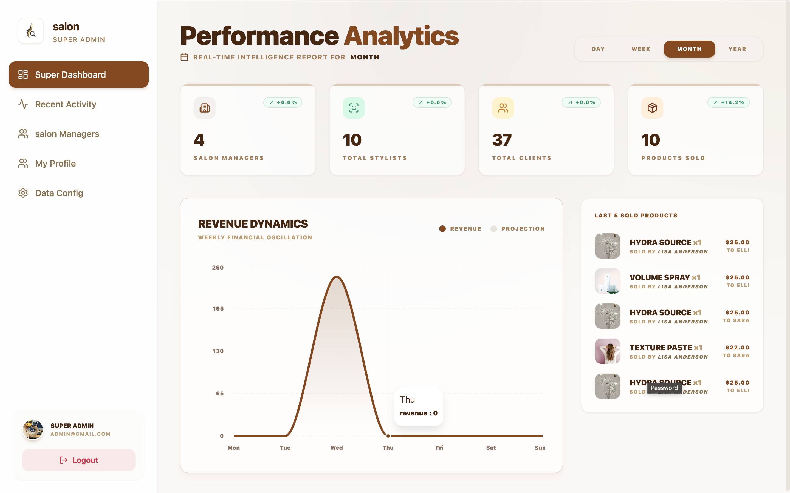
<!-- slide -->
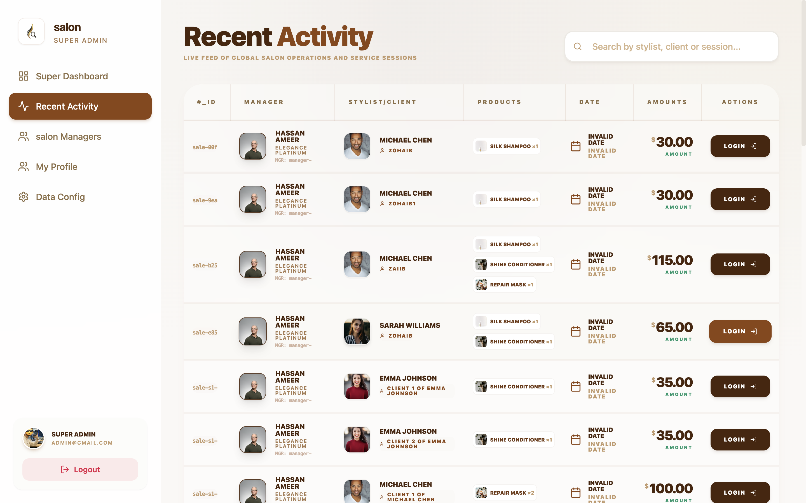
<!-- slide -->
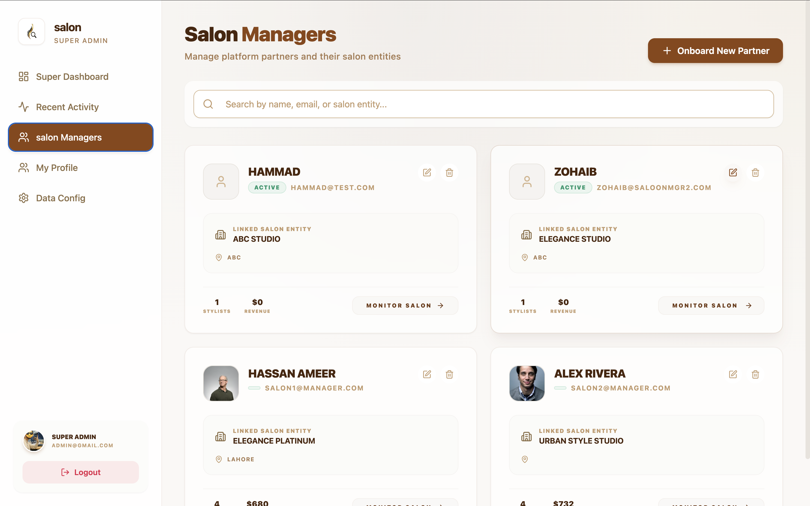
<!-- slide -->
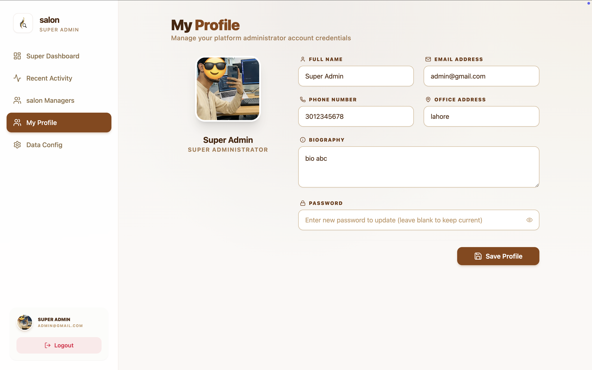
<!-- slide -->
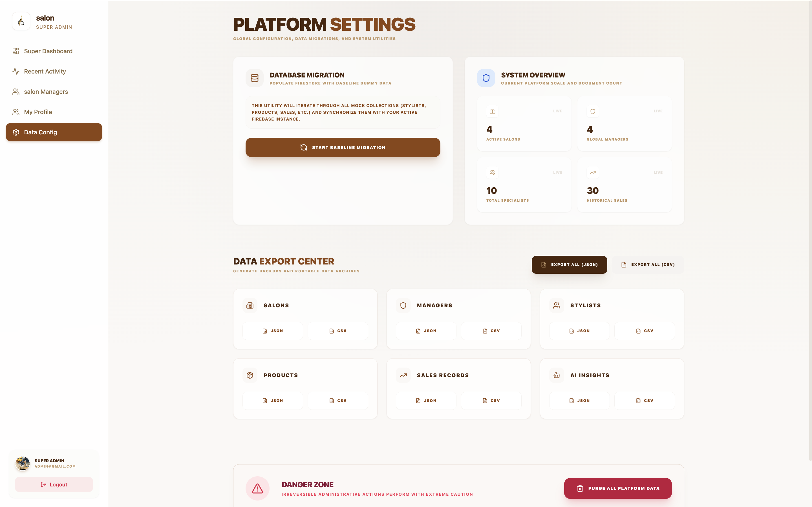
````

---

### 2. 🏪 Salon Manager Flow
Each salon branch has its own manager who handles day-to-day operations specific to that location. They can manage stylists, products, clients, and branch-specific branding.

- **URL Path:** `/manager`
- **Default Credentials:** `salon1@manager.com` / `12345678`

#### **Salon Manager Dashboard Preview:**
````carousel
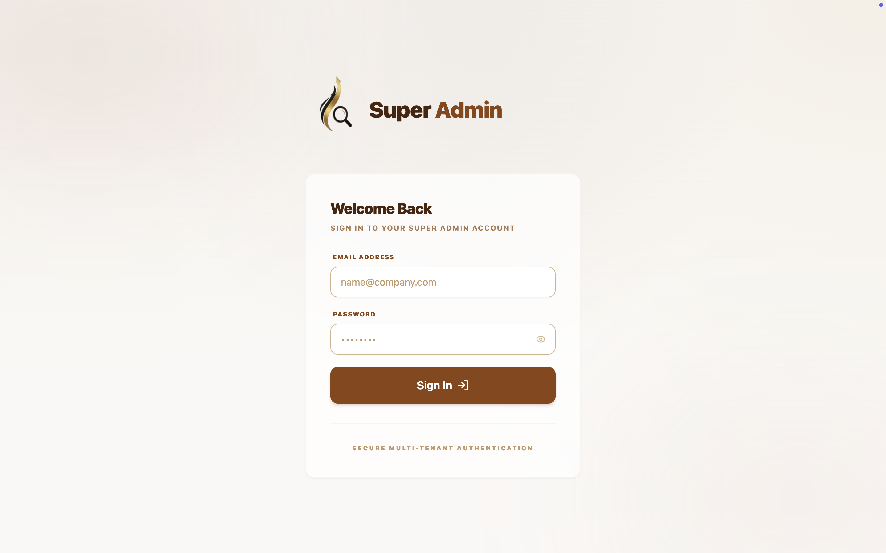
<!-- slide -->
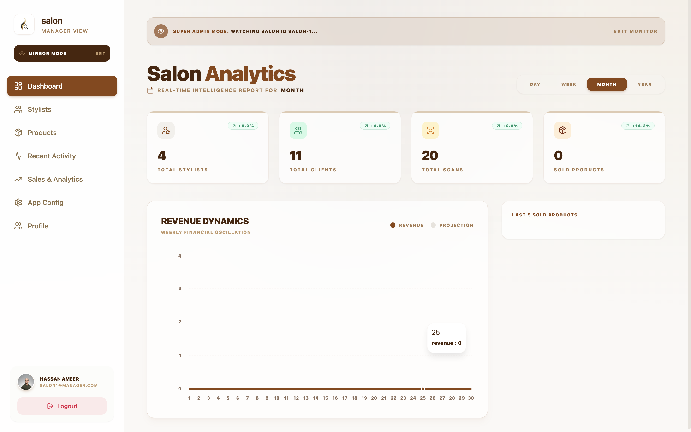
<!-- slide -->
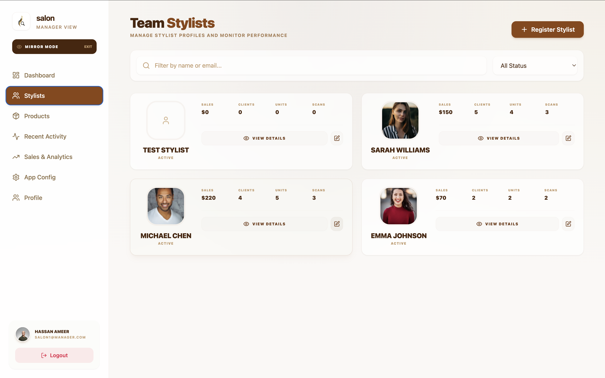
<!-- slide -->
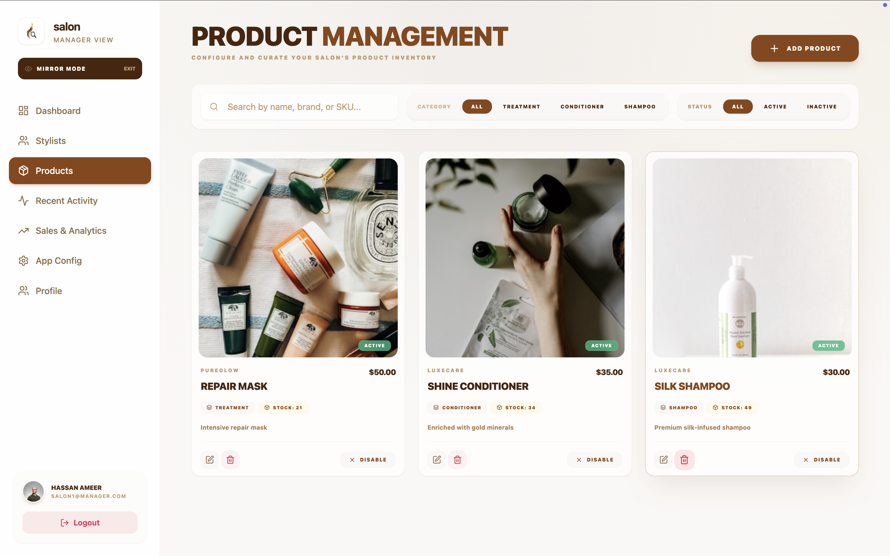
<!-- slide -->
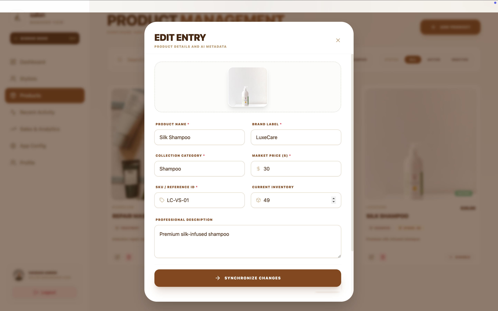
<!-- slide -->
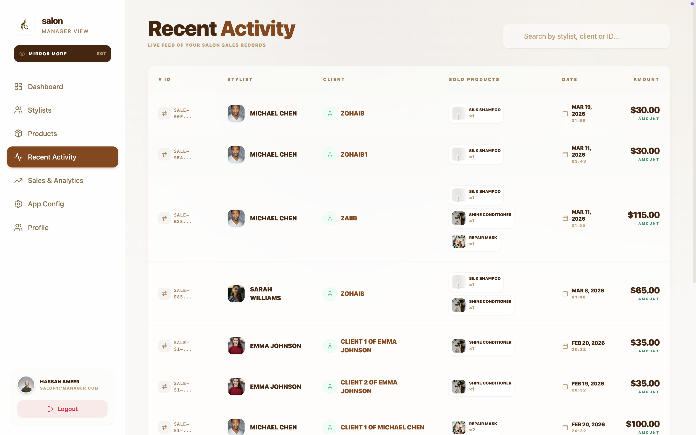
<!-- slide -->
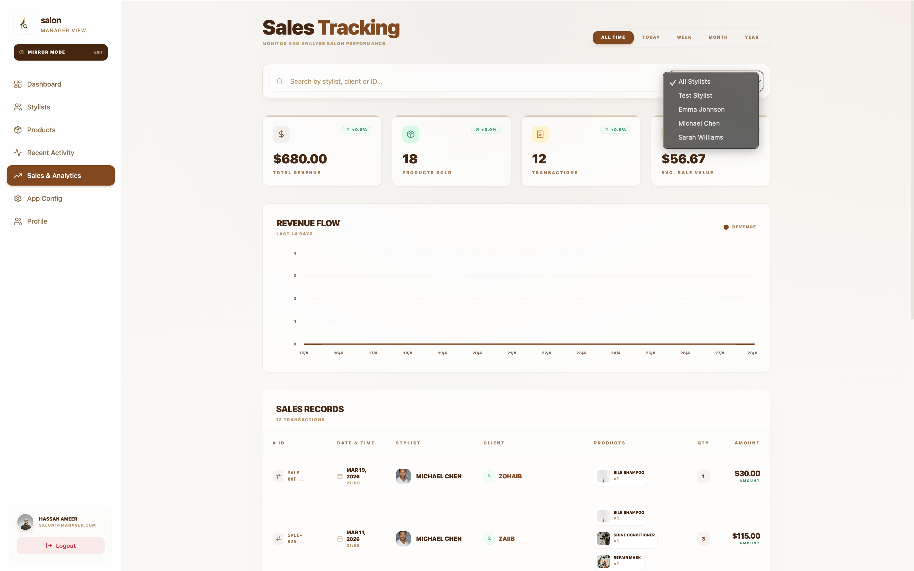
<!-- slide -->
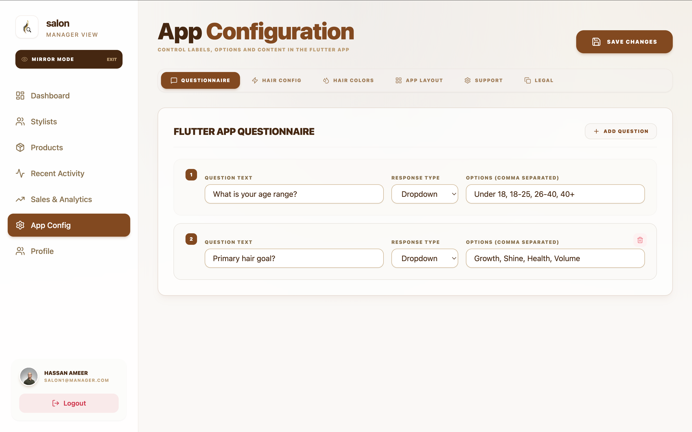
<!-- slide -->
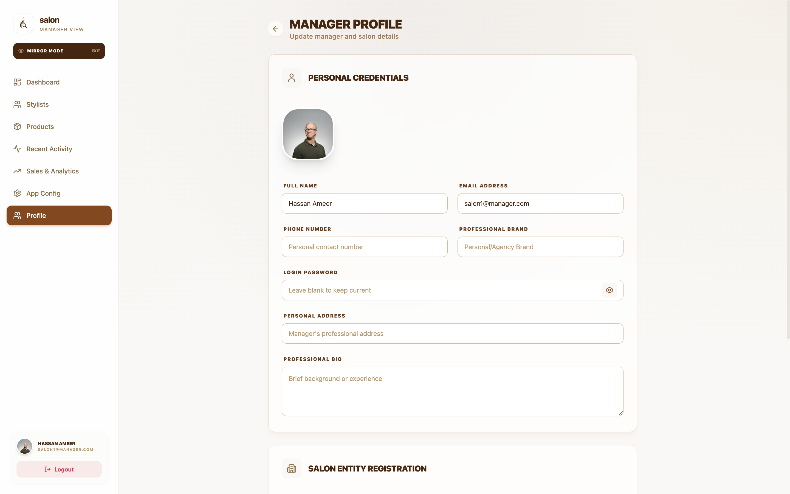
````

---

## 📂 Project Structure
```text
.
├── demo/               # Flow screenshots and demo images
├── public/             # Static assets
├── src/                # Main application source code
│   ├── components/     # Reusable UI components
│   ├── lib/            # Firebase and utility configurations
│   ├── pages/          # Super Admin and Manager pages
│   └── ...
├── firebase.json       # Firebase configuration
└── package.json        # Dependencies and scripts
```

---

## ⚡ Quick Start

1. **Install Dependencies:**
   ```bash
   npm install
   ```

2. **Run Locally:**
   ```bash
   npm run dev
   ```

3. **Deploy to Firebase:**
   ```bash
   npm run build
   firebase deploy
   ```

---

## 📊 Demo Data
To populate the dashboard with sample data:
1. Log in as **Super Admin**.
2. Go to **Developer Center** -> **Seeding Page**.
3. Run the **Migration/Seed** process.
